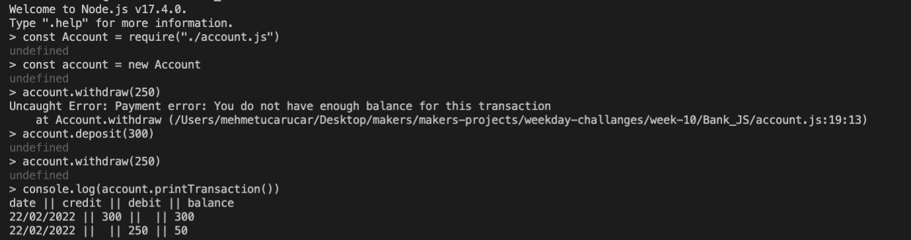

## User Stories:

As a bank customer,
So that I can use the banks services,
I would like to create a bank account.

As a bank customer,
So that I can buy stuff with my card,
I would like to be able to deposit money to my bank account.

As a bank customer,
So that I can have some cash,
I would like to be able to withdraw money from my bank account.

As a bank,
So that I don't lose money,
I won't let customers withdraw if their balance is 0.

As a bank,
So that I don't lose money,
I won't let customers withdraw if balance is less than withdraw amount.

As a bank customer,
So that I can keep track of my finances,
I would like to be able to print a bank statement.

As a bank customer,
So that I can keep track of when I spent money,
I would like my statement to include date for activity.

# How to use the program

Clone this repo and run npm install: 

```
git clone https://github.com/robinucar/Bank_JS.git
npm install
```
Launch node on the terminal and require the program file:
```
node
const account = require("./account.js")
```
Here is an example of program command:

```
account = new Account()
account.deposit(500)

account.deposit(1000)

account.withdraw(500)

account.printTransaction()

```

## How to run the tests
``` 
jest
```
## Screenshot of app running in the terminal



## Approach

- I planned the domain using paper and pen, defining the methods
    Account class deals with making deposits , withdraws , and printTransaction 
- I tested all my code with node
- I tested my edge cases
- I tested all restriction which are not be able to withdraw if balance is 0 or if balance is less than withdraw amount


